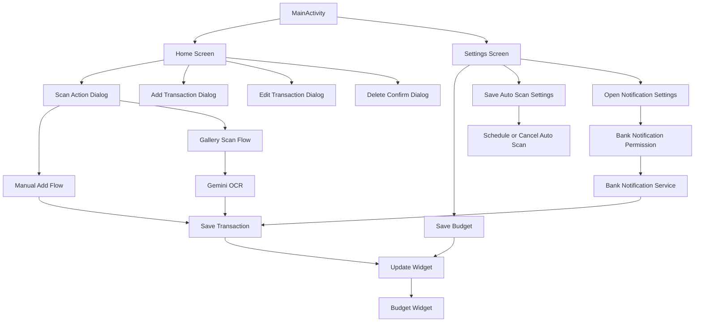

# Wireframe and Flows

This document describes the main screens, UI flow, and background behavior of Zero Touch Budget.

## 1. Screen Map

## 2. Primary Screens

### Home Screen

The home screen is the main app surface.

It shows:

- today's remaining budget,
- amount spent today,
- budget limit,
- a transaction list for today,
- and quick actions for add or scan.

Main actions:

- open settings,
- add a manual transaction,
- scan a receipt from the gallery,
- edit a transaction,
- delete a transaction.

### Settings Screen

The settings screen lets the user manage:

- daily budget,
- auto-scan enable/disable,
- auto-scan interval,
- auto-scan start time,
- scan source,
- custom folder selection,
- and notification listener access.

### Widget

The widget mirrors the daily summary and acts as a quick view surface.

It shows:

- remaining budget,
- spent amount,
- budget limit,
- transaction count,
- and budget state color.

## 3. Detailed Flows

### Flow A: Manual Transaction

1. User taps the add button on the home screen.
2. The add dialog opens.
3. User enters amount, store or brand, and category.
4. App saves the transaction locally.
5. Widget refreshes with the new total.

### Flow B: Edit Transaction

1. User taps the edit icon on a transaction row.
2. The edit dialog opens with the current values.
3. User updates amount, store or brand, or category.
4. App replaces the old transaction with the updated one.
5. Widget refreshes.

### Flow C: Delete Transaction

1. User taps the delete icon on a transaction row.
2. The confirm dialog appears.
3. User confirms deletion.
4. App removes the transaction locally.
5. Widget refreshes.

### Flow D: Gallery Receipt Scan

1. User taps the add button on the home screen.
2. User chooses "Scan from gallery".
3. The system image picker opens.
4. User selects an image.
5. The app converts the image to bitmap and corrects orientation.
6. Gemini extracts amount and brand from the receipt.
7. App saves the parsed transaction.
8. Widget refreshes.

### Flow E: Bank Notification Tracking

1. User grants notification listener access from Settings.
2. Supported bank notifications arrive on the device.
3. The notification listener reads title and text.
4. The parser extracts spending data.
5. The transaction is stored locally.
6. Widget refreshes.

### Flow F: Budget Settings

1. User opens Settings.
2. User updates the daily budget.
3. App saves the new budget to the daily summary record.
4. Widget refreshes to reflect the new number.

### Flow G: Auto Scan Settings

1. User opens Settings.
2. User enables auto-scan.
3. User picks the interval, start time, and source.
4. If needed, user grants photo access or selects a custom folder.
5. App saves settings and schedules or cancels background work.

## 4. Background Flows

### Auto Scan Worker Flow

- Bootstrap worker sets up the recurring schedule after reboot or first launch.
- Auto-scan worker checks the selected source.
- Image finder collects candidate images.
- OCR pre-check filters files before running the OCR pipeline.
- Receipt images are processed and saved if valid.

### Daily Reset Flow

- Daily reset worker runs on schedule.
- The app recalculates the new day's state.
- Widget updates with fresh totals.

## 5. State Behavior

### Budget States

- Safe: spending is below the warning threshold.
- Warning: spending is approaching the daily limit.
- Over budget: remaining amount is negative.

### Receipt Processing States

- Idle
- Processing
- Success
- Error

### Auto Scan States

- Disabled
- Enabled with schedule
- Enabled but waiting for start time
- Running background scan

## 6. Wireframe Notes

- The app uses a simple two-screen shell: Home and Settings.
- The home screen is built to feel like a dashboard, not a deep navigation app.
- The widget is intentionally treated as a first-class surface.
- Manual entry is kept as a fallback when automation is not enough.

## 7. Summary

The full flow centers on one idea: reduce effort.

Users can enter data manually, scan receipts, rely on bank notification parsing, or let background auto-scan handle image sources. All paths update the same local data and keep the widget in sync.
